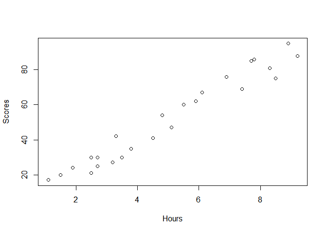
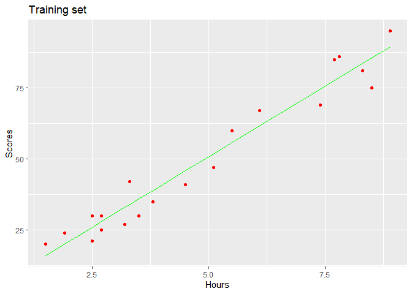
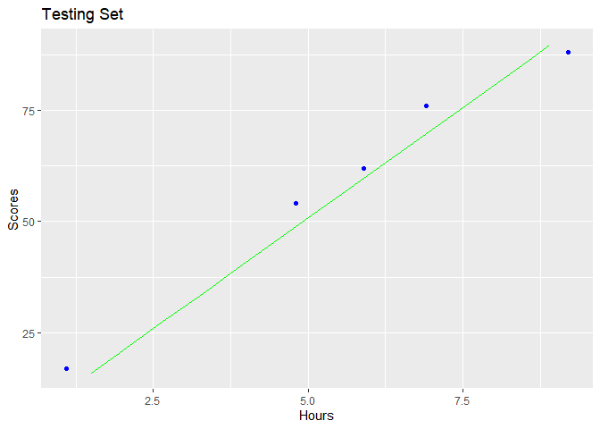
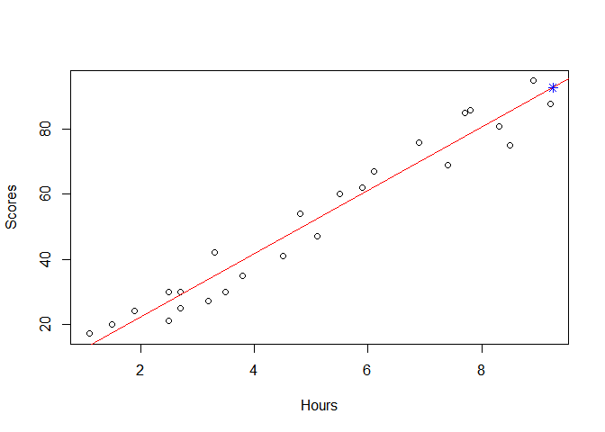

# GRIP under The Sparks Foundation - Data Science and Business Analytics
## Prediction using Supervised ML  
### **Problem Statement** - Predict the percentage Scores of an student based on the no. of study Hours using Simple Linear Regression
  
**Importing necessary Libraries**

```r
# Uncomment the following to install packages 
#install.packages("ggplot2")
#install.packages("caTools")
library(ggplot2)
library(caTools)
```
  
**Downloading, understanding and cleaning dataset**  
Data can be downloaded from http://bit.ly/w-data

```r
url<-"http://bit.ly/w-data"
data<-read.csv(file=url)
head(data)
```

```
##   Hours Scores
## 1   2.5     21
## 2   5.1     47
## 3   3.2     27
## 4   8.5     75
## 5   3.5     30
## 6   1.5     20
```

```r
dim(data)
```

```
## [1] 25  2
```

```r
summary(data)
```

```
##      Hours           Scores     
##  Min.   :1.100   Min.   :17.00  
##  1st Qu.:2.700   1st Qu.:30.00  
##  Median :4.800   Median :47.00  
##  Mean   :5.012   Mean   :51.48  
##  3rd Qu.:7.400   3rd Qu.:75.00  
##  Max.   :9.200   Max.   :95.00
```

```r
is.null(data)
```

```
## [1] FALSE
```

```r
any(is.na(data))
```

```
## [1] FALSE
```
  Data consists of 25 rows, 2 columns ; Hours of study per day(independent variable) and Score(dependent variable) . 
  Data is clean with no null or missing values.  
  
**Data Visualization**

```r
plot(data)
```

<!-- -->

Subsetting data into training sets(75%) and testing sets(25%) with split ratio=4/5

```r
set.seed(100)
split<-sample.split(data$Hours,SplitRatio = 4/5)
train<-subset(x=data,split==TRUE)
test<-subset(x=data,split==FALSE)
model<-lm(Scores~Hours,train)
summary(model)
```

```
## 
## Call:
## lm(formula = Scores ~ Hours, data = train)
## 
## Residuals:
##      Min       1Q   Median       3Q      Max 
## -10.5980  -4.8484  -0.2649   4.4934   8.1126 
## 
## Coefficients:
##             Estimate Std. Error t value Pr(>|t|)    
## (Intercept)    1.071      2.959   0.362    0.722    
## Hours          9.944      0.545  18.247 4.66e-13 ***
## ---
## Signif. codes:  0 '***' 0.001 '**' 0.01 '*' 0.05 '.' 0.1 ' ' 1
## 
## Residual standard error: 5.854 on 18 degrees of freedom
## Multiple R-squared:  0.9487,	Adjusted R-squared:  0.9459 
## F-statistic:   333 on 1 and 18 DF,  p-value: 4.663e-13
```
  Plotting Training set 

```r
ggplot() +
  geom_point(aes(x=train$Hours,y=train$Scores),colour="red")+
  geom_line(aes(x=train$Hours,y=predict(model,train)),colour="green")+
  ggtitle ("Training set")+
  xlab("Hours")+
  ylab("Scores")
```

<!-- -->
  
Testing Set Results 

```r
ggplot() +
  geom_point(aes(x=test$Hours, y=test$Scores),colour = 'blue') +
  geom_line (aes( x= train$Hours, y=predict(model,train)),colour = 'green') +
  ggtitle ('Testing Set') +
  xlab ('Hours') +
  ylab ('Scores') 
```

<!-- -->
   
  Comparing Actual and Predicted values

```r
predictions<-predict(model,test)
new<-cbind(test$Scores,as.integer(predictions))
colnames(new)<-c("Actual","Predicted")
new<-as.data.frame(new)
new
```

```
##   Actual Predicted
## 1     88        92
## 2     62        59
## 3     17        12
## 4     54        48
## 5     76        69
```

Simple Linear Regression Model to predict unknown values

```r
linear_model<-lm(formula = Scores~Hours,data)
plot(data)
abline(linear_model,col="red")
test<-data.frame(Hours=9.25)
result<-predict(linear_model,test)
points(test,result,col="blue",pch=8)
```

<!-- -->

```
## [1] "If a student studies for 9.25 hours/day he will Score 92.909855"
```
  
**Root Mean Squared Error (RMSE) to measure the model prediction error**

```r
mse <- mean((new$Actual -new$Predicted)^2)
rmse <- sqrt(mse)
rmse
```

```
## [1] 5.196152
```
The lower the RMSE, the better the model.
